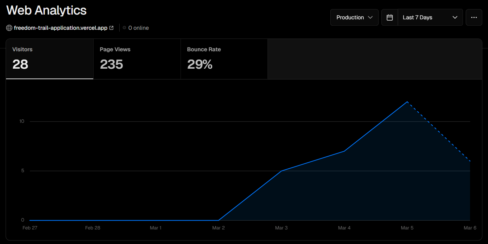

# Boston Freedom Trail Application
### CS 4241 Final Project

#### Team E: Error-Prone Engineers
#### William Gilmore, Adrian Johnson, Andrew Mesa, Keira Schoolcraft, Katy Stuparu

#### Application Link: https://freedom-trail-application.vercel.app

---

1. <h3>  brief description of what you created, and a link to the project itself (two paragraphs of text) </h3>
   
   - Our team developed a Freedom Trail application to make exploring historic sites more engaging and informative.
   The app serves as a digital guide, helping users navigate the trail while providing detailed historical information 
   about each landmark. Since it’s designed primarily for mobile users, the majority of the user facing pages were optimized
   for mobile. To make the journey more interactive, we added a badge system where users can collect 
   badges as they visit different locations, giving them a way to track their progress along the trail.
   - In addition to providing historical insights, the app allows registered users to contribute by adding businesses 
   to the platform. Once logged in, users can submit business listings relevant to trail visitors. The app also features real-time 
   location tracking, enabling users to see their current position and nearby points of interest. We used MongoDB to store 
   user progress, badges, businesses, and authentication data, ensuring that all user interactions are saved and accessible 
   across sessions. By combining badges to earn, historical insights, and user contributions, our Freedom Trail application 
   offers an interactive way to explore this iconic route. 
   - [**Freedom Trail App**](https://freedom-trail-application.vercel.app).

2. <h3> Any additional instructions that might be needed to fully use your project (login information etc.) </h3>
   
   1. Anyone can sign up for an account using their email, or log in using their Google account. 
   However, badges are earned by walking the freedom trail and getting close enough to a landmark. 
   Therefore, your account will not have any badges in it if you don't walk the freedom trail 
   2. To view the badges you can log into the account that was used for testing, which has multiple badges associated with it:
      1. **Username:** freedomtrailapplication@gmail.com 
      2. **Password:** Mvst1234
   3. Due to stricter privacy settings in Safari live location tracking may nto always work in everyone's safari browser.
   All other browsers, both mobile and laptop, such as chrome or Microsoft Edge work with the live location tracking.
   Furthermore, all other functions of the application work in Safari allowing users to still learn about the freedom
   trail using the app in Safari.
   4. App is designed for both laptops and mobile, but on mobile it's designed for the vertical orientation, so testing the
   app in that orientation provides best experience.
   
3. <h3>An outline of the technologies you used and how you used them.</h3>
   1. **NextJS framework with Tailwind CSS**
      1. Our team built the project using Next.js, taking advantage of its flexible routing, API routes, and many 
      different libraries and features such as NextAuth, user sessions, and analytics. 
      Majority of our pages utilized "use client", allowing the majority our rendering to happen on the client side, 
      and manipulation of our MongoDB and items in it to happen in the API routes (backend). We styled everything 
      with Tailwind CSS, which made it easy to create a clean, responsive design for both laptops and mobile. 
      Using Next.js also allowed for a smooth deployment process on Vercel, making it easy to get our app live with no 
      financial costs and minimal setup.
   2. **Authentication with NextAuth**
      1. As a team, we implemented NextAuth.js for authentication, integrating both Google OAuth and our own MongoDB-based 
      email & password system with encryption for secure user credentials. We utilized sessions to restrict access to certain 
      actions, such as allowing only logged-in users to add businesses. Additionally, we leveraged NextAuth’s built-in sign-in 
      and sign-out functions to streamline the authentication process.
   3. **Application Analytics with Vercel**
      1. We used Vercel's free app analytics and speed testing tools to gain insights into our application's performance. 
      This helped us monitor load times, user interactions, and overall responsiveness, allowing us to identify areas for 
      improvement. By leveraging these built-in analytics, we ensured our app remained fast, efficient, and user-friendly, 
      making data-driven optimizations throughout development.
       
        
   4. **MongoDB Database for Multiple Objects**
      1. We used MongoDB to store key data for our application, including location nodes, user badges, user login credentials, 
      and business information. This allowed us to keep everything in persistent storage, so user progress, authentication, 
      and business data remained available across sessions. With MongoDB, and the support it has for Next.js projects
      we could easily retrieve and display this data on the client side, ensuring a smooth experience for users.

   2. !!! ADD TO THIS LATER
* Map stuff
* Google Maps geocoding API

4. <h3> What challenges you faced in completing the project. </h3>
   
   1. For our project, each person in our team tried something new. Everyone in our team had a good amount of experience with web application development, either from CS 3733 Software Engineering, summer internships, or personal projects. One way that we challenged ourselves was choosing to use Next and React rather than React and Express. It was difficult at first to understand the difference between client and server files in the Next framework, but once we understood more about how to use Next, it became much easier for us to write our application code. We ended up appreciating some of the cool things built into Next, such as routing from folders. 
   2. Another challenge we faced was with procrastination. With each of our busy schedules, it was difficult to find times to meet as a team. Without meeting all the time, it was sometimes difficult for everyone to stay on top of their tasking. However, with clear communication through our Discord group chat, we were able to work with each other to make sure that we were accomplishing our goals.

5. <h3> What each group member was responsible for designing / developing. </h3>

   * **William Gilmore** - Displayed location nodes on the map along with their corresponding information pop-ups.
   * **Adrian Johnson** - Made Figma mockups for various pages, created account (login, register, and profile) pages.
   * **Andrew Mesa** - Got authentication working with both Google OAuth and local encryption/database, got location nodes and badges from the database, edited banner and menu bar to include starting and stopping tracking.
   * **Keira Schoolcraft** - Created the map, added live location tracking functionality, styled various sections of the application, tested our application on the Freedom Trail, wrote location descriptions and took pictures of sites.
   * **Katy Stuparu** - Created the frontend forms, backend routes, and database schema for creating, editing, deleting, and viewing business accounts and their corresponding location nodes, including using an address to location geocoding API.

6. <h3> A link to your project video. </h3>
